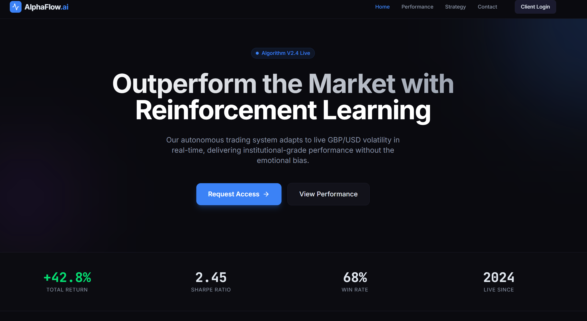

# 📈 Système de Trading Autonome GBP/USD




Une plateforme de trading algorithmique de niveau institutionnel exploitant l'**Apprentissage par Renforcement Profond (Deep RL)** et l'**Apprentissage Automatique d'Ensemble (Ensemble ML)** pour trader la paire de devises GBP/USD. Ce système dispose d'une API backend robuste pour l'inférence en temps réel et d'un tableau de bord commercial pour la surveillance et l'analyse.

## 🚀 Fonctionnalités Clés

### 🧠 Cœur IA Avancé
-   **Deep Reinforcement Learning (PPO/A2C)** : Un agent qui apprend à maximiser la récompense à long terme plutôt que de simplement prédire la direction du prix.
-   **Stratégie d'Ensemble** : Combine des modèles ML traditionnels (XGBoost, Random Forest) avec des agents DRL pour une prise de décision robuste.
-   **Gestion des Risques Adaptative** : Dimensionnement dynamique des positions et mécanismes de stop-loss basés sur la volatilité du marché.

### 🌐 Tableau de Bord Commercial & Marketing
-   **Landing Page Publique** : Interface marketing à haute conversion expliquant la stratégie (comparaison RL vs ML).
-   **Portail Client** : Tableau de bord sécurisé (`/dashboard`) pour les investisseurs afin de voir les signaux en direct et la performance du compte.
-   **Onglet Analyse de Marché** : Graphiques interactifs simulant les données de marché en temps réel (Prix, RSI, MACD).
-   **Visualisations de Performance** : Courbes d'équité professionnelles et analyse des drawdowns utilisant Recharts.

### ⚡ Infrastructure
-   **Backend FastAPI** : API asynchrone haute performance pour servir les prédictions des modèles.
-   **Support Docker** : Déploiement conteneurisé pour des environnements cohérents.
-   **Tests Complets** : Tests unitaires et d'intégration pour les pipelines ML et les points de terminaison de l'API.

---

## 🛠️ Stack Technique

### Backend
-   **Langage** : Python 3.10+
-   **Framework** : FastAPI
-   **Bibliothèques ML** : PyTorch, Stable Baselines3, Scikit-learn, XGBoost, Pandas, Numpy.
-   **Traitement des Données** : Ta-Lib (Analyse Technique).

### Frontend
-   **Framework** : React (Vite)
-   **Langage** : TypeScript
-   **Style** : Tailwind CSS, Framer Motion (Animations).
-   **Graphiques** : Recharts.
-   **Icônes** : Lucide React.

---

## 📦 Installation

### Prérequis
-   Python 3.10+
-   Node.js 18+
-   Docker (Optionnel)

### 1. Configuration du Backend

```bash
# Cloner le dépôt
git clone https://github.com/leochrls/gbpusd-trading-sytem.git
cd gbpusd-trading-sytem

# Créer l'environnement virtuel
python -m venv venv
source venv/bin/activate  # Sur Windows : venv\Scripts\activate

# Installer les dépendances
pip install -r requirements.txt
```

### 2. Configuration du Frontend

```bash
cd dashboard

# Installer les dépendances
npm install

# Démarrer le serveur de développement
npm run dev
```

### 3. Déploiement Docker (Optionnel)

```bash
docker-compose up --build
```

---

## 🖥️ Utilisation

### Lancer l'API
Démarrez le serveur backend pour servir les prédictions :

```bash
uvicorn api.app:app --host 0.0.0.0 --port 8000 --reload
```
La documentation de l'API sera disponible sur : `http://localhost:8000/docs`

### Accéder au Tableau de Bord
Une fois le frontend lancé (port par défaut 5173), naviguez vers :

-   **Accueil** : `http://localhost:5173/` (Landing Page Marketing)
-   **Tableau de Bord Client** : `http://localhost:5173/dashboard` (Signaux en Direct & Analyse)

---

## 📂 Structure du Projet

```
gbpusd-trading-system/
├── api/                 # Application FastAPI
├── dashboard/           # Frontend React
│   ├── src/
│   │   ├── components/  # Composants UI réutilisables (AnalysisPanel, Charts)
│   │   ├── pages/       # Composants de routage (Landing, Dashboard, Strategy)
│   │   └── layouts/     # Wrappers de mise en page
├── data/                # Stockage des datasets
├── evaluation/          # Scripts de backtesting et de comparaison
├── models/              # Modèles ML/RL sauvegardés
├── tests/               # Tests unitaires et d'intégration
├── training/            # Pipelines d'entraînement des modèles
│   ├── ml/              # Entraînement ML traditionnel
│   └── rl/              # Entraînement Reinforcement Learning
└── docker-compose.yml   # Orchestration des conteneurs
```
